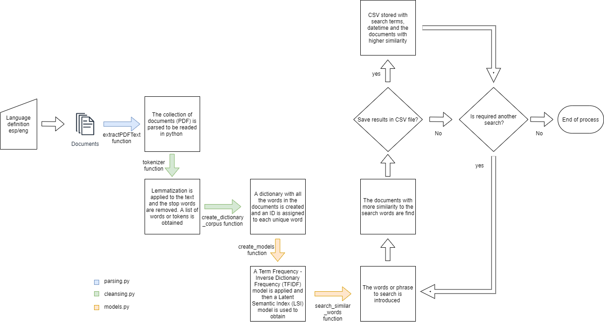

# Words Search 
## Python package to perform words search in a set of PDF documents

With this package it can be searched for a set of words or a phrase inside multiple PDF documents. The package has the following scripts and functions:
## parsing.py
> This script has the function that parse a PDF document and then can be readed by python
- ***extractPDFText***
    - **input**: 
        - *route* - path to a pdf document
    - **returns**: 
        - *text* - extracted text in string format
        
## cleansing.py
> Whit this script the cleansing and preproccesing functions are implemented
- ***tokenizer***
    - **input**: 
        - *sentence* - the sentence or text at which lemmatization and cleansing proccess will be applied
        - *lang* - The language that the app will be working on
    - **returns**: 
        - *tokens* - list of words after the stop words are removed and the lemmatization is applied
- ***generate_corpus***
    - **input**: 
        - *tokens* - list of words to generate the dictionary object
        - *save_dict* - If True the generated dictionary is saved (False by default)
    - **returns**: 
        - *dictionary* - dictionary object containing the unique words on the documents
        - *corpus* - structured set of machine-readable texts where differents IDs are assigned to different words
        - *words_frequency* - List of tuples with words IDs and frequency
        
## models.py
> The NLP models used are implemented in this script
- ***create_models***
    - **input**: 
        - *dictionary* - dictionary previously generated by the *generate_corpus* function
        - *corpus* - corpus previously generated by the *generate_corpus* function
    - **returns**: 
        - *tfidf_model* - Term Frequency-Inverse Document Frequency (TF-IDF) model obtained after be feeded with the corpus
        - *lsi_model* - Latent Semantic Index (LSI) model obtained after be feeded with the TF-IDF model
        - *similarity_matrix* - Similarity Matrix generated using the LSI model
- ***search_similar_words***
    - **input**: 
        - *search_terms* - the words or phrase to search
        - *dictionary* - dictionary previously generated by the *generate_corpus* function
        - *tfidf_model* - tfidf model previously generated by the *create_models* function
        - *lsi_model* - lsi model previously generated by the *create_models* function
        - *similarity_matrix* - similarity matrix previously generated by the *create_models* function
        - *lang* - The language that the app will be working on
    - **returns**: 
        - *similarity_list* - A list with the documents that have the higher similarity indexes respect to the search words

## main.py
> As the name suggests, this is the main script that uses all the other scripts to find the words that are required to be searched on the documents. If the user want it, the search results can be stored in a CSV file.  
> Below is the whole procces that is performed in order to search the introduced words.

